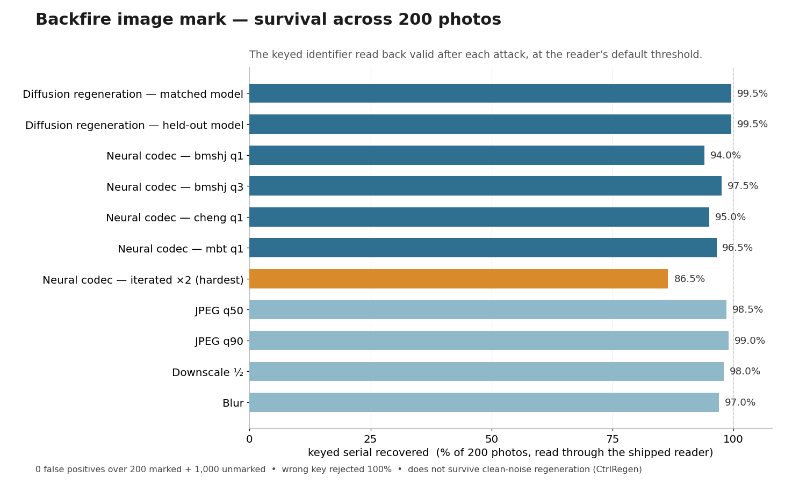

# Backfire

**A keyed image watermark that AI provenance-stripping attacks amplify instead of remove.**

Experimental research from Creative Mayhem. Source-available and dual-licensed: Business Source License 1.1 (free for non-commercial use), or a commercial license.

## Why this exists

Creative Mayhem builds AI-generated content (rAIdio.bot, vAIdeo.bot, lysn.fm) and the provenance tooling meant to keep it accountable (provcheck). Attaching provenance is easy; making it survive the tools built to erase it is the hard and responsible part. Backfire is a first, honest attempt at a watermark that does not just resist a removal attack but turns it around. It is experimental, and we are releasing it in the open, limits and self-red-team included, because that is what is worth publishing.

## The attack, and the credit

Invisible watermarks hide bits in imperceptible pixel detail. A **regeneration** (diffusion-purification) attack removes them by running the image back through a diffusion model, which snaps it onto the natural-image manifold and drops the off-manifold perturbation, the watermark. This is published, proven work (Zhao et al., *Invisible Image Watermarks Are Provably Removable Using Generative AI*, NeurIPS 2024, [arXiv:2306.01953](https://arxiv.org/abs/2306.01953)), and open provenance-stripping tools make it practical.

We are genuinely glad that work is out in the open. Backfire exists *because* of it, and the paper's own conclusion points the way: it recommends shifting toward watermarks that keep the image semantically consistent, which is exactly the direction Backfire takes. To us at Creative Mayhem this is an interesting technical challenge that we are happy to take a look at.

## The idea

Instead of hiding the mark where the purifier deletes it, Backfire **optimizes the mark to be a fixed point of the purifier**, an attractor it reconstructs. So running the attack makes the keyed identifier read *stronger*. The attack backfires. That is the thesis, and the name.

## How it works

- **Keyed carriers.** HMAC-keyed frequency carriers; only the key holder can write or read, a wrong key reads nothing.
- **Fixed-point optimization.** Embed optimizes the mark by gradient descent *through* a differentiable diffusion purifier, so the purifier reinforces it. Slow, GPU-bound.
- **Keyed detection.** A keyed, decoy-normalized correlation. numpy only: no GPU, no weights. Anyone with the key verifies instantly.

## What we measured

All of it on the shipped mark (256 px, 30 dB), attacked and then read back through Backfire's own reader at its default threshold, so every number is what the tool actually reports, not a friendlier proxy. Measured over 200 COCO val2017 photos.

Every bar is recomputed from the raw per-image verdicts in [`repro/survival_200.jsonl`](repro/survival_200.jsonl); regenerate the chart with `python repro/plot_survival.py`.

- **It survives the real removal attack.** Against the published Zhao et al. WatermarkAttacker ([arXiv:2306.01953](https://arxiv.org/abs/2306.01953)), the keyed identifier reads back valid on 99.5% of 200 photos after the diffusion regeneration, on the matched model *and* a held-out one. That the mark reads *stronger* after the attack, the amplification Backfire is named for, is reproducible with `repro/demo_amplify.py`.
- **It survives a neural-codec re-encode too.** Against the same paper's VAE codec attacker, 94 to 97.5% survive across four compression models the mark was never tuned against; an iterated double-pass, the hardest case in the set, holds 86.5%, and we say so rather than drop it. So Backfire survives *both* removers behind the "provably removable" result, not just the diffusion one.
- **No false positives.** Zero valid reads over 200 unmarked images and every wrong-key read, at the default threshold. The reader normalizes each margin against a robust decoy noise floor, which holds the false-positive rate to zero over 1,000 unmarked images too (see `LIMITS.md`): the unmarked margin sits near the floor while a real mark clears it several times over. Failing safe is the point.
- **It shrugs off everyday handling.** JPEG 99.0% (quality 90) and 98.5% (quality 50), half-size downscale 98.0%, and blur 97.0%. It does *not* survive a hard crop, the carriers are position-locked; we disclose that rather than hide it.
- **Low visibility, content-dependent.** 30 dB PSNR: the mark hides in detailed images but shows as a faint texture on large flat regions, so it is subtle rather than strictly invisible, and we would rather say that than oversell it. A quieter mark trades survival for lower visibility; the embed also offers perceptual-mask and luminance-only modes (`--pmask`, `--luma`) and a content-adaptive mode (`--auto`) that reduce visibility further.
- **What it does not survive, stated plainly.** Controllable regeneration from clean noise (for example CtrlRegen) rebuilds the image from scratch and removes the mark at real strength; an aggressive band-notch it detects rather than survives. No watermark is unremovable; Backfire wins against the deployed strippers and is honest about the frontier it does not. See `LIMITS.md`.

## The weakness, and its answer

A sophisticated attacker who reads this source can strip the mark with an aggressive **band-notch**; we could not make the linear mark survive that, and we say so. But the notch is loud, it carves a spectral hole natural images lack, so `read` also runs a tamper tripwire. Across 300 clean images and 81 notch configurations (feathered evasions included), no notch both strips the mark and evades detection, at either resolution:

| attacker's move | the mark | the tripwire |
| --- | --- | --- |
| deployed diffusion stripper | **amplifies** | not needed |
| aggressive notch, to strip it | removed | **detected** |
| gentle notch, to stay quiet | **survives** | pointless |

Remove the mark or stay quiet. Not both.

## Honest limits

4-bit keyed identifier today (unbounded keyspace); minutes-per-image embed (`read` is instant); operates at 256 or 512 px (512 is Stable Diffusion's native resolution and needs a 16 GB-class GPU to embed); the mark is not crop-invariant (position-locked carriers); validated at research scale, not production millions; the amplification claim is scoped to purification-class strippers, and the notch boundary is detected, not survived. It does **not** survive controllable regeneration from clean noise (for example CtrlRegen), a newer and stronger attack that rebuilds the image instead of editing it; see `LIMITS.md`.

## Why we publish the whole method

By publishing it, we lose nothing and gain transparency. The secret that protects the technique is the user's key, not the algorithm. Showing exactly how Backfire works gives an attacker nothing without your key, and the one algorithm-level exception, the notch, ships with its own tripwire. The `read` portion of the app needs only numpy and pillow, so you can reproduce detection, the tripwire, and our stated limits yourself. `repro/` reproduces the amplification on a public sample image; we left the tools to check our work; we publish a reader, not the scrubber.

## License

Business Source License 1.1 (free for non-commercial use) OR a commercial license, copyright Creative Mayhem UG (haftungsbeschränkt). Commercial or for-profit production use requires a paid license from Creative Mayhem (licensing@creativemayhem.com). **Every released version automatically becomes open source (AGPL-3.0-or-later) four years after its first public distribution**, so nothing here stays closed forever. Use is also subject to `EULA.md` and, for any hosted offering, `TOS.md`. Standalone, and not bundled into the Apache-2.0 provcheck binary. Full terms in `LICENSING.md`.
